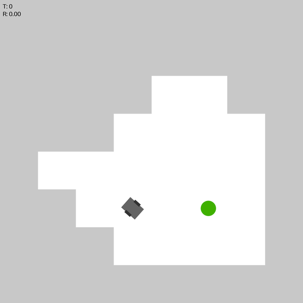

# QuickNav - Robot Navigation in JAX

> TODO: possibly better project name

This repository contains a JAX implementation of the robot navigation problem. The goal is to navigate a robot in a 2D grid world with obstacles, using reinforcement learning techniques.

## Demo



## Installation

1. Install `uv`: https://docs.astral.sh/uv/getting-started/installation/
2. Afterwards, create a new virtual environment and install the dependencies using `uv`:
```bash
uv sync
```

> Alternatively, you can use `poetry` or anything that works with `pyproject.toml` (but `uv` is ultra superior!)

To format the code, you can run:
```bash
uvx ruff format
```

## Running

To get started, checkout `examples/intro.ipynb` for a quick introduction to training the agent, evaluation and visualization of the environment.
Choose python from `.venv` as interpreter and it should work out of the box.

## TODO

- [x] Randomized start and goal positions
- [ ] Experiment with different algorithms (currently we use PPO, good alternatives are PQN, SAC, TD3)
- [ ] Experiment with differnt NN (currently we use default 2 hidden layers (64, 64), see `ppo.config` in `intro.ipynb`)
- [ ] Better observations for the policy (currently position & rotation of the robot + position of the goal)
    - [ ] Maybe include rotation and/or distance of the goal
- [ ] Randomized obstacles (walls) generation
    - [ ] Simulate lidar sensor to detect walls and avoid them
    - [ ] Add negative reward for hitting walls
    - [ ] Add walls to visualization
- [ ] Experiment with better reward function