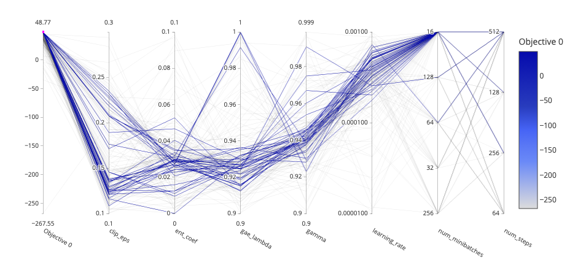

## Hyperparameter tuning results

To inspect the results saved in db files in this directory, run:

```bash
optuna-dashboard examples/tuning/results/PPO_study.db
```

(or replace `PPO_study.db` with the name of the db file you want to inspect)

`optuna-dashboard` should be installed within the virtual environment you used to run the tuning.

## Figures

### PPO

|      |      |
| ---- | ---- |
|  |  |
|  | |

### TD3

|      |      |
| ---- | ---- |
|  |  |
|  | |

### SAC

|      |      |
| ---- | ---- |
|  |  |
|  | |
